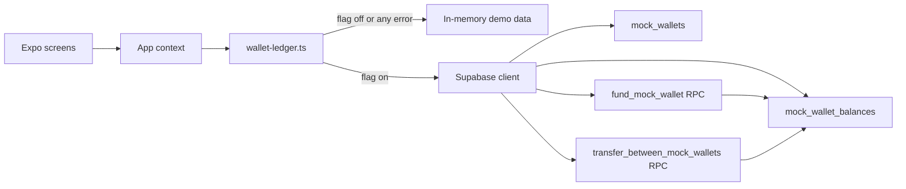
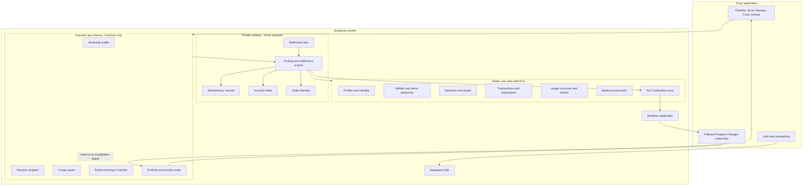
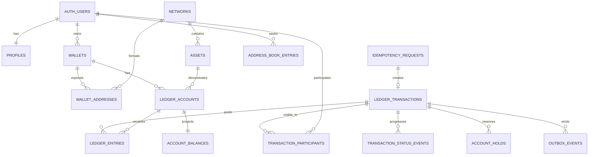
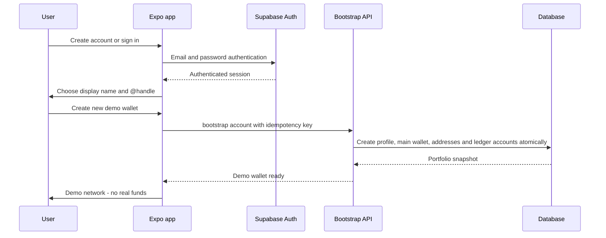
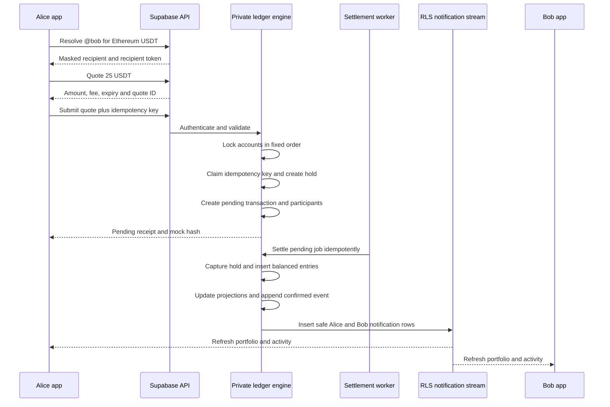

# Professional Supabase Architecture for the Trust Wallet Demo

Status: architecture and migration plan only. No database or application changes were applied during this review.

Reviewed: July 18, 2026

## 1. Recommended outcome

Build this as a **centralized demo ledger with a Trust Wallet-like experience**, not as a real self-custody wallet and not as a fake blockchain.

The finished app should let a signed-in user:

1. Create a clearly labeled demo wallet.
2. Add an arbitrary amount of mock funds within technical safety limits.
3. Receive a unique demo address for each supported network.
4. Send to another account by `@handle`, canonical demo address, QR code, or saved contact.
5. See one shared transfer update the sender and recipient atomically.
6. See pending, confirmed, failed, reversed, fee, and funding activity.
7. Retry safely without sending twice.
8. Use two devices without local-only balances diverging.

The application must never create, request, import, or store a real recovery phrase or private key. Every money screen and QR payload must say **Demo network - no real funds**.

## 2. What was verified

### Connection status

| Check | Result | Meaning |
|---|---|---|
| Supabase connector | Connected | The connector can query the project successfully. |
| Project reference | `bgwsoyfsyoecsuemckel` | Matches the repository URL and legacy client configuration. |
| Project health | `ACTIVE_HEALTHY` | PostgreSQL 17 in `ap-northeast-1`. |
| Repository-scoped MCP entry | Correct URL, but `enabled = false` | The installed connector works; the local `.codex/config.toml` entry itself is disabled. |
| Expo runtime environment | Missing | `expo-wallet/.env` does not exist. |
| Expo remote-ledger feature flag | Missing and undocumented | The service remains in local mode unless `EXPO_PUBLIC_ENABLE_SUPABASE_LEDGER=true`. |
| Live publishable keys | Available | The project has both a legacy public key and a modern publishable key. |
| Expo publishable key | Not configured | The mobile app cannot use the live project in the current checkout. |
| Legacy browser preview | Connected to the same project | Its URL and legacy public key match the live project. |

### Live database snapshot

| Item | Verified state |
|---|---:|
| Supabase Auth users | 4 |
| Public tables | 13 |
| Mock-ledger tables with RLS | 5 |
| Legacy public tables without RLS | 8 |
| Applied repository migrations | 1 |
| Mock wallets | 2 |
| Mock balance rows | 10 |
| Funding events | 0 |
| Transfers | 0 |
| Legacy rows | 53 across seven populated legacy tables |
| Security advisor findings | 36 |
| Performance advisor findings | 140 |

The only applied migration is `20260425030500_mock_wallet_ledger`.

The legacy row counts are: 9 networks, 7 assets, 1 wallet, 5 user-wallet rows, 10 transactions, 18 wallet-transaction rows, 3 app-config rows, and 0 user-balance rows. These records must be treated as exposed until the old schema is contained.

An independent read-only REST probe using the public key was able to read live legacy data. The current `app_config` rows include an application-PIN setting; device PINs must not be stored in a globally exposed table.

## 3. Trust Wallet behavior to reproduce safely

Real Trust Wallet is self-custodial. A recovery phrase derives chain-specific accounts and addresses; the app signs a transaction with a private key, and a blockchain node handles balance lookup and broadcasting. Trust Wallet's Wallet Core documentation explicitly separates address derivation and signing from node communication.

This demo should reproduce the **product flow**, not the cryptography:

| Real wallet concept | Safe demo equivalent |
|---|---|
| Recovery phrase | Supabase Auth account plus an explicit demo-wallet record |
| Chain-derived address | Generated canonical `demo:<network>:<body>` address |
| On-chain balance | Balance projection rebuilt from an immutable journal |
| Signed transaction | Authenticated, authorized Supabase RPC request |
| Mempool/pending state | Pending ledger transaction plus a balance hold |
| Confirmation | Idempotent mock settlement worker |
| Block explorer | Transaction-detail screen with mock hash, status events, and audit timestamps |
| Network fee | Balanced entries in the chain's native demo asset |
| ENS/name service | Optional unique `@handle` resolved by a restricted API |

Official references:

- [Trust Wallet Core usage guide](https://developer.trustwallet.com/developer/wallet-core/integration-guide/wallet-core-usage)
- [Trust Wallet receive flow](https://trustwallet.com/blog/cryptocurrency/how-to-receive-crypto-using-trust-wallet)
- [Trust Wallet buy flow and third-party providers](https://trustwallet.com/blog/guides/how-to-buy-cryptocurrency-using-trust-wallet)

## 4. Current architecture and its limits



### Useful foundation already present

- Expo has a Supabase client using publishable-key environment variables.
- Email/password sign-up, sign-in, session persistence, and sign-out exist.
- The mock migration has RLS on its five tables.
- Funding and same-owner wallet transfers run inside PostgreSQL functions.
- The current transfer locks the source balance row before subtracting funds.
- The app context can load wallets and transfer history.
- Receive, Send, Fund, QR, address-book, wallet, and history screens exist as visual foundations.

### Gaps that block the requested workflow

| Area | Current state | Required change |
|---|---|---|
| Recipient | Destination wallet must have the same owner | Resolve a different user's handle or demo address. |
| Recipient history | Transfer row belongs only to the sender | Record both users as transaction participants. |
| Accounting | Mutable balance row is the financial truth | Immutable, balanced journal plus rebuildable projection. |
| Retention | Deleting a wallet cascades into balance and financial-event rows | Archive wallets; journal history must use immutable retention and restrictive foreign keys. |
| Assets | A symbol is global | Identify an asset by network and contract/native identity. |
| Amounts | `numeric(28,8)` in SQL and JavaScript `number` | Integer base units in SQL and strings across the API. |
| Retry safety | No idempotency key | Unique user/operation/idempotency constraint and response replay. |
| Concurrency | Only source balance is locked | Fixed-order account locks, holds, and idempotent settlement. |
| Lifecycle | Only `completed` or `failed` | Submitted, pending, confirmed, failed, expired, reversed. |
| Fees | None | Quote and post a separately balanced native-asset fee. |
| Addresses | Hard-coded values in the screen | Database-backed demo addresses per wallet and network. |
| Send screen | Token search placeholder only | Asset, recipient, amount, quote, review, submit, receipt. |
| Fund screen | Navigation menu only | Explicit Add Demo Funds workflow calling the ledger API. |
| Receive screen | Hard-coded real-looking addresses | Canonical demo address and demo-only QR payload. |
| QR scanner | Static camera placeholder | Parse and validate only the demo URI scheme. |
| Address book | Device-local state | User-owned Supabase records with network validation. |
| Realtime | No secure mock-ledger subscription | Own-user, RLS-protected notification rows via filtered Postgres Changes plus refetch. |
| Failure behavior | Any Supabase error silently falls back locally | Show the error; keep offline demo mode explicit and isolated. |
| Auth routing | Auth UI exists but the root stack does not gate by session | Route unauthenticated users to auth and bootstrap only after sign-in. |
| Account creation | Empty users automatically receive two wallets | One idempotent onboarding transaction creates the selected wallet. |

## 5. Target system architecture



### Design boundary

- `public`: RLS-protected records users may read; clients receive no direct financial write privileges.
- `api`: exposed functions only. Every function has a fixed signature, validates `auth.uid()`, uses an empty search path, and receives explicit grants.
- `private`: posting engine, idempotency, holds, jobs, audit internals, and system accounts. This schema is not exposed through the Data API.
- `realtime`: Postgres Changes streams only safe `demo_wallet_notifications` rows; RLS and an `owner_id` filter restrict each subscriber to its own invalidations.

The current Realtime publication must first remove five legacy tables without RLS (`assets`, `transactions`, `user_wallets`, `wallet_transactions`, and `wallets`). Only the new RLS-protected notification table should be added for ledger invalidations.

## 6. Target data model



### Identity and wallet tables

| Table | Important fields | Rules |
|---|---|---|
| `profiles` | `user_id`, `display_name`, `handle`, `handle_normalized`, timestamps | One per Auth user; normalized handle is unique and immutable without a controlled rename flow. |
| `wallets` | `id`, `owner_id`, `name`, `kind`, `is_default`, `status` | Multiple demo wallets per user; limits prevent spam. |
| `wallet_addresses` | `wallet_id`, `network_id`, `canonical_address`, `display_body` | Unique per wallet/network; only canonical demo addresses are accepted for transfers. |
| `address_book_entries` | `owner_id`, `network_id`, `label`, `canonical_address` | Owner-only RLS; address must resolve to a valid demo address. |

Recommended QR payload:

```text
trust-demo:v1?network=ethereum&address=demo%3Aethereum%3A0x...
```

A bare real blockchain address must be rejected by the posting API. The UI may show the familiar-looking body, but Copy and QR should preserve the `demo:` marker.

### Network and asset catalog

| Table | Important fields | Rules |
|---|---|---|
| `networks` | `id`, `slug`, `name`, `chain_family`, `address_format`, `enabled` | Stable reference data. |
| `assets` | `id`, `network_id`, `symbol`, `name`, `decimals`, `kind`, `contract_ref`, `enabled` | `USDT` on Ethereum and `USDT` on another chain are separate assets. |
| `asset_prices` | `asset_id`, `currency`, `price`, `as_of`, `source` | Display-only; never changes ledger units. |

### Ledger and lifecycle tables

| Table | Purpose | Important rules |
|---|---|---|
| `ledger_accounts` | User and system accounts per asset | Kinds include `user_available`, `system_issuer`, `system_fee`, and `system_adjustment`. |
| `ledger_transactions` | One business operation | Contains type, lifecycle status, actor, mock hash, quote, reversal link, and timestamps. |
| `ledger_entries` | Immutable signed postings | Each amount is a non-zero `numeric(78,0)` base-unit integer. No update or delete. |
| `account_balances` | Fast projection | Rebuildable from entries; stores posted, held, and available units. |
| `account_holds` | Pending-spend reservation | Open, captured, released, or expired; an account cannot spend held units. |
| `transaction_participants` | Read authorization | Sender and recipient both see the same transaction without seeing unrelated data. |
| `transaction_status_events` | Immutable lifecycle history | Submitted, pending, confirmed, failed, expired, reversed. |
| `idempotency_requests` | Retry protection | Unique on user, operation, and idempotency key; binds to a request hash. |
| `settlement_jobs` | Reliable delayed confirmation | Claimed with `FOR UPDATE SKIP LOCKED`; retries are bounded and idempotent. |
| `audit_events` | Security audit | Append-only, redacted, and admin-only. |
| `demo_wallet_notifications` | Safe client invalidation | One non-sensitive row per affected user; own-user RLS and filtered Postgres Changes trigger authoritative refetches. |

## 7. Non-negotiable ledger invariants

1. For every posted transaction and asset, the sum of all entries is exactly zero.
2. Every client amount enters the API as a decimal string and is converted once to integer base units.
3. JavaScript floating-point numbers are never authoritative for balances or transfers.
4. Posted entries are never updated or deleted.
5. Corrections create a linked reversal transaction with opposite entries.
6. `account_balances` must equal the sum of posted entries and can be rebuilt.
7. Available balance equals posted balance minus open holds.
8. A user spending account cannot have a negative available balance.
9. Every financial write has an idempotency key and request hash.
10. A retry with the same key and same request returns the original result.
11. A retry with the same key and a different request is rejected.
12. Sender and recipient account rows are locked in a deterministic order.
13. The recipient is bound into a short-lived quote; submit cannot silently change it.
14. Each final transaction has exactly one terminal lifecycle event.
15. Users can read only transactions in which they are explicit participants.
16. Deleting or archiving a user-facing wallet never deletes posted journal history.
17. There is no implicit cross-network transfer; any future bridge simulation is a separate, explicitly quoted operation.
18. An entry's asset must equal its ledger account's asset, enforced with relational constraints as well as posting code.

A deferred constraint trigger should verify the zero-sum invariant before commit. Database tests should also reconcile every projection against the journal.

## 8. Account creation flow



Recommended choices:

- **Create new demo wallet**: creates the main wallet and supported demo addresses.
- **Add watch-only demo address**: tracks a valid canonical demo address without transfer permission.
- Do not show a BIP-39-like recovery phrase. Supabase account recovery handles account access.
- A PIN or biometric lock protects the local app session and belongs in SecureStore/device storage, not in the financial schema.

Disable anonymous sign-in for the connected mode. If a guest experience is retained, make it a separate offline mode with a permanent banner and no path that can be confused with the shared Supabase ledger.

## 9. Add Demo Funds flow

The UI should say **Add Demo Funds**, not imply a real card purchase. Never accept real payment-card data. Use a fixed visual provider such as `Demo Faucet` or `Demo Card - 4242`.

Example: add 100 USDT on Ethereum, where USDT has 6 decimals.

| Account | Entry in base units | Display |
|---|---:|---:|
| System USDT issuer | `-100000000` | -100 USDT |
| User USDT account | `+100000000` | +100 USDT |
| Total | `0` | 0 |

Funding API behavior:

1. Authenticate and reject anonymous Auth users.
2. Validate wallet ownership, asset, decimal precision, and positive amount.
3. Enforce a high technical maximum, rate limit, and wallet/account limits.
4. Claim the idempotency key.
5. Insert a funding transaction, two balanced entries, participants, status events, audit event, and own-user notification row in one transaction.
6. Update the balance projection through internal code only.
7. Return the confirmed transaction and new portfolio snapshot.

## 10. Cross-account transfer flow



For the initial reliable release, settlement may be configured as immediate. The same schema still supports a short mock delay later. If delayed settlement is enabled, the worker must be retry-safe and a stuck-job monitor must release or retry expired holds.

### Fee example

Alice sends 25 USDT and pays a 0.001 ETH mock network fee.

| Asset | Account | Entry |
|---|---|---:|
| USDT | Alice | -25 USDT |
| USDT | Bob | +25 USDT |
| USDT | Asset total | 0 |
| ETH | Alice | -0.001 ETH |
| ETH | System fee collector | +0.001 ETH |
| ETH | Asset total | 0 |

Each asset must balance separately. A USDT transfer cannot hide an ETH imbalance.

## 11. API surface

The client should not directly mutate any ledger table.

| API | Purpose | Access |
|---|---|---|
| `api.bootstrap_demo_account` | Create profile, main wallet, addresses, and accounts | Authenticated, once/idempotent |
| `api.create_demo_wallet` | Add another demo wallet | Authenticated owner |
| `api.get_portfolio` | Return wallets, accounts, balances, and price metadata | Authenticated owner |
| `api.resolve_recipient` | Resolve handle or canonical demo address to masked identity | Authenticated, rate-limited |
| `api.create_transfer_quote` | Bind sender, recipient, asset, amount, fee, and expiry | Authenticated owner |
| `api.submit_transfer` | Create hold and pending transfer | Authenticated owner, idempotent |
| `api.add_demo_funds` | Post balanced demo funding | Authenticated owner, idempotent and rate-limited |
| `api.get_activity` | Cursor-paginated participant activity | Authenticated participant |
| `api.get_transaction` | Detailed receipt and status events | Authenticated participant |
| `api.save_address_book_entry` | Validate and save a demo recipient | Authenticated owner |

Every financial function should:

- use `SECURITY DEFINER` only where required;
- live in the dedicated `api` or private schema, not `public`;
- use `SET search_path = ''` and fully qualified identifiers;
- explicitly check `auth.uid()` and reject anonymous Auth sessions;
- revoke execute from `PUBLIC` and `anon`;
- grant execute only to `authenticated` for the intended wrappers;
- expose no service or secret key to the app.

## 12. RLS, grants, and Realtime

### Database access

- Enable RLS on every table in an exposed schema.
- Revoke broad default privileges from `anon` and `authenticated`.
- Grant only `SELECT` on the reference and user-readable tables that the client truly needs.
- Do not grant clients `INSERT`, `UPDATE`, `DELETE`, or `TRUNCATE` on journal, balance, hold, system-account, audit, job, or transaction-state tables.
- Use explicit grants in every migration. As of May 30, 2026, new Supabase projects do not automatically expose new public tables through the Data API.
- Put ownership predicates and indexed participant predicates in every user-data policy.
- Use `(select auth.uid())` in policies where appropriate so the planner can use an init plan.

### RLS-protected live updates

Publish only `public.demo_wallet_notifications` through `supabase_realtime`. Grant authenticated users `SELECT`, enable RLS, and allow a user to read only rows where `owner_id = (select auth.uid())`. Clients receive no insert, update, or delete privilege.

The Expo client subscribes to `INSERT` events on that table with the server-side filter `owner_id=eq.<auth-user-id>`. Rows contain only `id`, `owner_id`, `event_type`, `transaction_id`, and `created_at`; they never contain balances or private recipient data. Every event is only an invalidation signal, so the client calls `get_portfolio` and `get_activity` again instead of treating the notification row as durable financial truth.

The original private Broadcast design could not pass hosted-project preflight because the migration role does not own Supabase-managed `realtime.messages` and therefore cannot install the required policies. The application-owned notification table keeps authorization within objects the migration owns and remains protected by row-level security.

References:

- [Supabase Row Level Security](https://supabase.com/docs/guides/database/postgres/row-level-security)
- [Supabase API security](https://supabase.com/docs/guides/api/securing-your-api)
- [Supabase Postgres Changes](https://supabase.com/docs/guides/realtime/postgres-changes)
- [2026 Data API grant change](https://supabase.com/changelog/45329-breaking-change-tables-not-exposed-to-data-and-graphql-api-automatically)

## 13. Current security findings and remediation order

### P0 - contain the exposed privileged credential

The tracked legacy browser configuration contains a live `service_role` credential for this project, and browser code uses that privileged value. Treat it as compromised.

Independent verification found the credential on the public `origin/main` history and confirmed with a read-only HTTP probe that it still receives a successful response. The unauthenticated legacy admin page initializes its browser client with this credential.

1. Rotate/revoke the exposed legacy privileged credential in Supabase.
2. Review API, Auth, and database logs for unexpected access.
3. Replace browser configuration with the modern publishable key only.
4. Remove all privileged-browser code paths.
5. Remove the credential from Git history in a separately coordinated history rewrite.
6. Invalidate affected local copies and deployments.

### P0 - close the old exposed schema

Eight public tables have RLS disabled: `wallets`, `transactions`, `networks`, `assets`, `user_balances`, `wallet_transactions`, `user_wallets`, and `app_config`.

They also retain broad grants and permissive policies. Do not merely enable RLS and keep `USING (true)` policies. Quarantine or retire these tables after confirming the preview dependency, and revoke unnecessary grants immediately in the cutover plan.

The legacy Realtime publication exposes five of these RLS-disabled tables. Remove them from the publication before treating Realtime as safe.

### P1 - harden functions and Auth

- Revoke default function execution from `PUBLIC` and `anon`.
- Move posting internals out of `public`.
- Set an empty immutable search path and fully qualify objects.
- Disable anonymous sign-ins for the shared ledger.
- Enable leaked-password protection.
- Add rate limits and storage-growth limits to mock funding and resolution.

The project currently has no anonymous Auth users, but anonymous sign-in is enabled and the Expo client contains a helper that can create an anonymous session. Supabase anonymous users use the `authenticated` database role, so role-only grants are not enough to distinguish them.

### Advisor summary

Security findings:

- 7 policies exist on tables where RLS is disabled.
- 8 public tables have RLS disabled.
- 3 privileged functions are executable by `anon` and `PUBLIC`.
- 3 privileged functions are intentionally executable by signed-in users but need a safer schema/grant boundary.
- 2 functions have mutable search paths.
- 12 anonymous-access warnings exist.
- Leaked-password protection is disabled.

Performance findings:

- 12 foreign keys lack a covering index.
- 4 policies call Auth helpers without the recommended init-plan form.
- 120 duplicate permissive-policy findings come from the legacy policy set.
- 4 indexes are currently unused; reassess only after realistic load tests.

Advisor remediation links:

- [RLS disabled with policies](https://supabase.com/docs/guides/database/database-linter?lint=0007_policy_exists_rls_disabled)
- [RLS disabled in public](https://supabase.com/docs/guides/database/database-linter?lint=0013_rls_disabled_in_public)
- [Anonymous SECURITY DEFINER execution](https://supabase.com/docs/guides/database/database-linter?lint=0028_anon_security_definer_function_executable)
- [Mutable function search path](https://supabase.com/docs/guides/database/database-linter?lint=0011_function_search_path_mutable)
- [Unindexed foreign keys](https://supabase.com/docs/guides/database/database-linter?lint=0001_unindexed_foreign_keys)
- [Multiple permissive policies](https://supabase.com/docs/guides/database/database-linter?lint=0006_multiple_permissive_policies)

## 14. Migration and cutover plan

Do not replace the current schema in one destructive migration. Use an additive, verified cutover.

### Phase 0 - security containment

- Rotate the exposed credential and remove it from all clients and deployments.
- Inventory callers of the eight legacy tables.
- Freeze new legacy writes.
- Back up the project and record counts/checksums.
- Capture the populated legacy schema, functions, policies, grants, triggers, and publication as an explicit baseline; they are currently unmanaged drift and cannot be reproduced from the one repository migration.

### Phase 1 - additive schema

- Create `api` and `private` schemas.
- Create profiles, networks, assets, wallets, addresses, accounts, journal, entries, balances, holds, participants, status events, idempotency, jobs, audit, notifications, and address book.
- Add explicit grants, RLS, indexes, constraints, and zero-sum verification.
- Seed network-aware asset catalog rows.
- Avoid `CREATE TABLE IF NOT EXISTS` for authoritative ledger objects because it can silently accept an incompatible pre-existing table.

### Phase 2 - transactional APIs

- Implement bootstrap, portfolio, recipient resolution, funding, quote, transfer submission, settlement, activity, and receipt APIs.
- Add request hashes, fixed-order locks, limits, and safe error codes.
- Add own-user RLS for `demo_wallet_notifications`, publish that table, and emit safe invalidation rows.

### Phase 3 - data backfill

- Preserve the four Auth users.
- Convert each existing mock wallet to the new wallet/address/account model.
- Convert every existing balance into a balanced `opening_balance` transaction against a system opening account.
- The current live snapshot has two wallets, ten balance rows, and no existing funding or transfer rows, so this backfill should be small but still reconciled.
- Verify old balance totals equal new journal-derived projections before cutover.

### Phase 4 - Expo integration

- Configure `expo-wallet/.env` with the project URL and modern publishable key.
- Remove the hidden remote-ledger flag or replace it with an explicit build mode.
- Gate navigation by Auth session and bootstrap after sign-in.
- Replace local numeric types with string/base-unit DTOs.
- Wire Add Demo Funds, Send, Receive, QR scanner, address book, activity, and transaction detail.
- Subscribe to own-user notification inserts with `owner_id=eq.<auth-user-id>` and refetch after each event.
- Remove silent local fallback. Keep offline demo mode as a different, visibly labeled adapter if desired.

### Phase 5 - controlled cutover

- Deploy to a Supabase development branch/project first.
- Run fresh migration reset and database tests.
- Re-run security and performance advisors.
- Run Expo typecheck/build and two-account tests.
- Switch reads to the new APIs, then financial writes.
- Monitor errors, stuck holds/jobs, reconciliation, and Realtime delivery.

### Phase 6 - legacy retirement

- Remove legacy tables from the Realtime publication.
- Move required archives to an unexposed `legacy` schema or export them.
- Drop permissive policies, broad grants, old functions, and legacy preview code.
- Perform destructive cleanup only in a later migration after the rollback window.

## 15. Verification gates

### Database tests

- Fresh database reset applies every migration in order.
- All exposed tables have RLS.
- `anon` cannot read user data or call financial APIs.
- User A cannot read User B's wallet, balance, contact, or unrelated activity.
- User A and User B can both read the same transfer as participants.
- Every transaction balances to zero per asset.
- Projection equals journal after rebuild.
- A reversal restores the expected balances without editing history.
- Two simultaneous attempts to spend 80 from a balance of 100 allow only one.
- Repeating the same request 100 times produces one transaction.
- Reusing an idempotency key with a changed amount is rejected.
- Failed or expired transfers release holds and post no transfer entries.

### Application tests

- Account creation waits for email confirmation when required.
- Auth routing never loads a remote wallet before a valid session.
- Add Demo Funds updates the same account on a second device.
- Handle, canonical address, QR, and address-book resolution choose the same recipient.
- A bare real-chain address is rejected with a clear demo-network message.
- Offline/network errors never create local success receipts in connected mode.
- Reconnect refetches portfolio and activity even if a Realtime event was missed.
- Sign-out clears private subscriptions and cached user financial data.

### Mandatory end-to-end acceptance test

1. Alice creates an account and a main demo wallet.
2. Bob creates a separate account and a main demo wallet.
3. Alice adds 100 USDT in demo funds.
4. Alice sends 25 USDT to Bob's `@handle`.
5. Alice has 75 USDT and Bob gains 25 USDT, excluding any explicitly quoted fee.
6. Both see one transaction with the same transaction ID and opposite direction labels.
7. Retrying the original request creates no additional transaction or entries.
8. Alice cannot read Bob's unrelated wallets or transactions.
9. The journal sums to zero and both projections match it.
10. A second device for Bob receives a private update and refetches the same result.

## 16. Recommended implementation order

| Order | Deliverable | Exit condition |
|---:|---|---|
| 1 | Credential rotation and legacy exposure containment | No privileged key is usable from a public client. |
| 2 | New ledger schema, grants, RLS, invariants, and tests | Fresh reset and advisors pass agreed gates. |
| 3 | Bootstrap and read APIs | Two Auth users have isolated wallets and portfolios. |
| 4 | Balanced Add Demo Funds | Funding reconciles and is idempotent. |
| 5 | Recipient resolution and cross-user transfer | Alice-to-Bob acceptance test passes without Realtime. |
| 6 | Realtime and lifecycle worker | Both devices update and stuck jobs recover. |
| 7 | Expo flow integration | Send, Fund, Receive, QR, history, and errors use the remote API. |
| 8 | Backfill and cutover | Old and new totals reconcile; connected mode has no silent fallback. |
| 9 | Legacy retirement | Old schema, policies, functions, and privileged preview paths are gone. |

This order intentionally makes the ledger correct and secure before making the UI appear fully connected.
